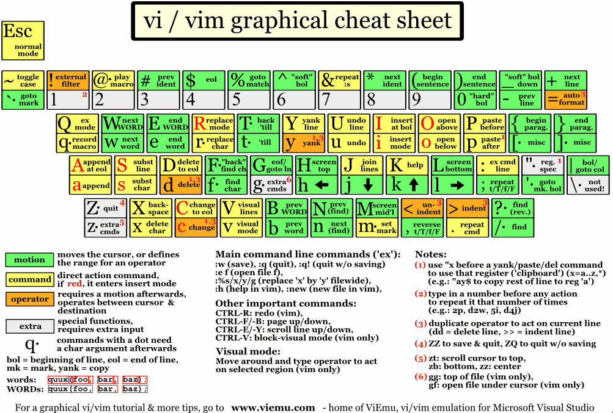
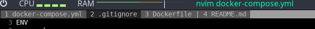
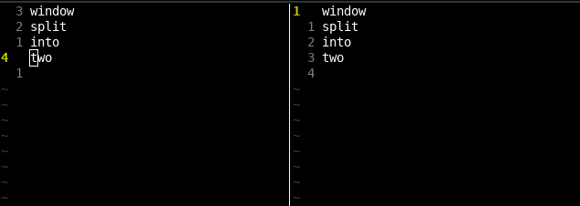
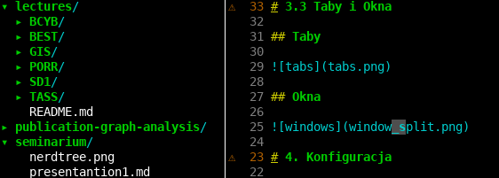
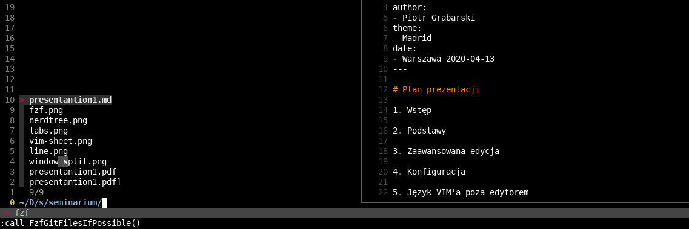

---
title:
- VIM basics
author:
- Piotr Grabarski
theme:
- Madrid
date:
- Warszawa 2020-04-19
---

# Plan prezentacji

1. Wstęp

2. Podstawy

3. Zaawansowana edyc

4. Konfigurac

5. Język VIM'a poza edytorem

6. Zakończenie

# 1. Wstęp
## VIM - Ulepszona wersja edytora VI
- wysoce konfigurowalny
- szybki
- zajmuje mało pamięci
- uniwersalny - jest dostępny na każdym unixowym systemie
- używa języka spójnego z innymi programistycznymi narzędziami
\

## Trzy pytania
- Czy każdy zna VIM'a?
- Kto lubi VIM'a?
- Kto używa VIM'a?

# 2. Podstawy
## Podstawy poruszania się i edycji tekstu
- Tryby
- Poruszanie się po pliku
- Operatory
- Obiekty tekstowe
- Liczniki
- Poruszanie się po tekście - motions
- Połączmy je
- Inne skróty

# 2.1 Tryby
## Normal mode - *Esc*
Najważniejszy, domyślny tryb. Wykonujemy w nim większość akcji

## Visual mode - *v*, *V*, *ctrl + v*
Tryb służący do zaznaczania oraz wykonywania akcji na zaznaczonym tekście

## Insert mode - *i*, *I*, *A*, *a*, *c*, *C*
Tryb służący do pisania - odblokowywuje "normalną" klawiaturę

## Command mode - *:*
Tryb ten służy do wywoływania komend we wbudowanym wierszu poleceń

## Select oraz ex
Rzadko używane tryby - nie wymagane do średnio-zaawansowanej edycji plików

# 2.2 Poruszanie się po pliku
## *h, j, k, l*
Można używać strzałek, ale nie jest to zalecane i wydajne, bo znajdują się
one daleko od centrum klawiatury.

- **h** - w lewo
- **j** - w dół
- **k** - w górę
- **l** - w prawo

## Inne skróty klawiszowe
- **gg** i **G** - początek i koniec pliku
- **ctrl + Y** - przewijanie w górę o jedną linię
- **ctrl + U** - przewijanie w górę o połowę okna
- **ctrl + B** - przewijanie w górę o całe okno
- **ctrl + E** - przewijanie w dół o jedną linię
- **ctrl + D** - przewijanie w dół o połowę okna
- **ctrl + F** - przewijanie w dół o całe okno

# 2.3 Operatory

### Operatory pozwalają na edycję tekstu poza trybem *Insert*

### Podstawowe operatory
- **d** - "delete" - usuń
- **c** - "change" - usuń i wejdź do trybu pisania
- **y** - "yank" - skopiuj do rejestru

### W Vimie musimy uwzględniać wielkość liter
- **D** - usuń całą linię
- **C** - usuń całą linię i wejdź do trybu pisania
- **Y** - skopiuj całą linię do rejestru
- **gu** - zmień z wielkiej litery na małą
- **gU** - zmień z małej litery na wielką

# 2.4 Obiekty tekstowe
##
W Vimie musimy patrzeć na plik jak na zestaw obiektów\
"a" oznacza "a lub all", czyli cały obiekt tekstowy\
"i" oznacza "inner", czyli jedynie wnętrze obiektu\

## Podstawowe obiekty tekstowe
- **aw, iw** - "word" - oznacza ciąg znaków zakończony znakiem specjalnym np. ".()[],-"
- **aW, iW** - "Word" - oznacza ciag znaków zakończony spacją
- **ap, ip** - "paragraph" - Oznacza tekst nieprzedzielony pustą linią
- **a{, i{** - obszar wewnątrz nawiasów klamrowych
- **a(, i(** - analogicznie
- **a[, i[** - analogicznie
- **a", i"** - analogicznie
- **a', i'** - analogicznie

# 2.5 Liczniki
## Vim pozwala na zwielokrotnianie wykonywanych akcji poprzez poprzedzenie ich liczbą całkowitą
- **20j** - przejdź 20 linii w dół
- **5w** - przejdź o 5 słów do przodu
- **5b** - przejdź o 5 słów do tyłu
- **10.** - powtórz poprzednią akcję 10 razy
- **10@q** - wykonaj makro 10 razy

# 2.6 Poruszanie się po tekście
## Poruszanie się po liniach
- **"liczba" + gg** - wybrana linia w pliku
- **ctrl + o** - powrót
- **0** i **$** - początek i koniec linii
- **^** - pierwszy niepusty znak w linii
- **%** - następny nawias zamykający

## Poruszanie się po słowach - motions
- w, W - przejście do początku następnego "słowa/Słowa"
- e, E - przejście do końca bieżącego słowa
- b, B - przejście do początku bieżącego słowa
- f, F - używane w połączeniu z jakimś innym znakiem. Małe "f" przechodzi do następnego wystąpienia
  wybranego znaku, a wielkie "F" do poprzedniego
- t, T - analogicznie do "f" tylko, że przenosi kursor przed szukany znak

# 2.7 Połączmy je
## [Licznik] [operator] [obiekt tekstowy / motion]
- **gUiW** - Zamiana całego "Słowa" na pisane wielkimi literami
- **dap** - Usuń cały paragraf wraz z pustą linią nad nim
- **4dw** - Usuń cztery następne słowa.
- **ci{** - usuń wszystko w najbliższych nawiasach klamrowych - np. ciało funkcji
  i przejdź do trybu pisania
- **2dt+** - Usuń wszystko do drugiego znalezionego znaku "+" bez samego
  "+" (znak szukany jest od miejsca wywołania do końca linii)

# 2.8 Inne skróty


# 3. Bardziej zaawansowana edycja
## Zaawansowana edycja projektów
- Wyszukiwanie
  - szukanie w bieżącym buforze
  - szukanie wybranego słowa
  - szukanie w całym projekcie
- Makra
- Taby
- Okna

# 3.1 Wyszukiwanie
## Szukanie w bieżącym buforze
Szukamy za pomocą **/** - następnie za pomocą **n** przechodzimy do następnego
wystąpienia, a **N** do poprzedniego

## Szukanie wybranego słowa
- za pomocą "*" - przechodzi do następnego wystąpienia
- za pomocą "#" - przechodzi do poprzedniego wystąpienia

## Szukanie po całym projekcie
- Można szukać po otwartych buforach
- Można użyć komendy **vimgrep**
- Można użyć znanego narzędzia **Silver searcher** inaczej **ag**.\
  Najłatwiej jest to osiągnąć dodając plugin fzf.

# 3.2 Makra
## Czym jest makro?
- Makro to zapisana/nagrana sekwencja wciśnięć klawiszy.
- Są one bardzo często wykorzystywane i potrafią znacznie przyspieszyć pracę.
  Piszemy program by napisać inny program
- Tworzenie ich jest ciekawym zajęciem - zaczynamy myśleć
  jak zrobić coś szybciej za pomocą makra

## Jak nagrać makro?
- Wciskamy **q + rejestr** - Rejestrem może być dowolny znak.\
  Teraz wszystko co zrobimy zostanie nagrane
- Kończymy nagrywanie **q**
- Uruchamiamy makro - **@ + rejestr**

## Operator "."
- "." - operator kropki jest najprostrzym makrem - powtarza poprzednią operację np. **diw** czyli
  usunięcie słowa.

# 3.2 Makra

## Przykład makra
Chcemy w każdym z 50 plików, mających po kilkadziesiąt funkcji, zmienić każdą nazwę funkcji z
snake_case na camelCase i zapisać nazwę każdej zmienionej nazwy w Changelogu.

- Przyjmijmy, że język to Python. Szukamy więc "def " np. za pomocą **vimgrep** będąc w pliku
  zawierającym Changelog
- Włączamy nagrywanie i idziemy do pierwszego znalezionego rezultatu
- Kopiujemy całą linię (**Y**) i wracamy do miejsca skąd wykonaliśmy skok (**ctrl** + *o*)
- Wklejamy w Changelogu i wracamy (**ctrl** + **i**)
- Zamieniamy nazwę funkcji na camelCase - ```:s#_\(\l\)#\u\1#g```
- Kopiujemy nową nazwę, cofamy się do pliku z Changelogiem i wklejamy
- Kończymy nagrywanie makra
- Uruchamiamy makro dowolną liczbę razy

# 3.3 Taby i Okna

## Taby



## Okna



# 4. Konfiguracja

## VIM jako IDE
- Vimrc
- Pluginy
  - Plugin managers
  - NerdTree
  - Powerline
  - Fugitive
  - fzf
- LSP

# 4.1 Vimrc
- Vimrc jest to plik konfiguracyjny Vima.
- Pozwala na kontrolę wersji naszego IDE - config w gicie
- Umożliwia zmienianie wbudowanych ustawień za pomocą komendy **set**
  Np. **set number** - Włączenie numerowania linii
- Umożliwia definiowanie własnych skrótów klawiszowych i makr
  Np. dodanie przenoszenia linii w dół - ```nnoremap <M-j> :m .+1<CR>==```
- Pozwala na zmianę wyglądu edytora - kolory, colorschemes
- Pozwala na dodawanie pluginów

# 4.2 Pluginy
## Menadżery pluginów
- vim-plug
- Vundle
- Pathogen

## NerdTree


# 4.2 Pluginy
## Powerline/Lightline


## Fugitive - integracja z gitem

## fzf - Fuzzy Finder


# 4.3 LSP
## Language Server Protocol
LSP to protokół oparty na JSON'ie opracowany przez firmę Microsoft.
Początkowo był tworzony tylko dla Visual Studio Code, ale obecnie jest otwartym standardem.
Można go używać w Vimie do auto uzupełniania, podpowiedzi, znajdowania definicji funkcji,
znajdowania i zamieniania tekstu itp.

## Neovim i CoC
- Neovim nie różni się mocno od zwykłego Vima, ale jest na pewno lepszy.\
  Wszystkie komendy zawarte w tej prezentacji działają w obu edytorach.
- Conqueror of Completition - Plugin do NeoVima pozwalający na łatwą integrację z LSP

# 5. Język VIM'a poza edytorem
Skróty vimowe są obecne w wielu programistycznych narzędziach, których używamy na co dzień, takich
jak **less**, **tig**, czy **sed** (składnia wyszukiwania taka jak w vimie).\
\
Inne narzędzia mające domyślne skróty vimowe:

- **Ranger i cfiles** - Terminalowe menadżery plików

- **Zathura** - PDF viewer

- **Tig** - Narzędzie ułatwiające pracę z gitem

- **SC-IM** - Terminalowy excel

- **Termite** - Emulator terminala

- **Inne** - <https://vim.reversed.top/>

# 5. Język VIM'a poza edytorem
Jest również wiele programów, które domyślnie nie mają włączonych skrótów vimowych ale
pozwalają na ich łatwą zmianę.\
\

### Przeglądarka
Przeglądarki oferują wiele rozszerzeń vimowych np.: Vimium

### Inne IDE
Np.: Emacs - Evil Mode oraz pochodne emacsa - spacemacs, doom-emacs

### Shell
Domyślnie shell (np.: bash, zsh) jest zwykle w trybie emacs,
ale można przełączyć go w tryb VIM

### Suckless - <https://suckless.org/>
Oprogramowanie minimalistyczne, które za cel stawia sobie minimalizację złużycia zasobów i prostotę
wykonania oraz działania

# Zakończenie
## Bibliografia
- Dokumentacja VIM'a - <http://vimdoc.sourceforge.net/htmldoc/>\
\
- VIM - Porady i tipy - <https://vim.fandom.com/wiki/Vim_Tips_Wiki>

## Dziękuję za uwagę
- Moja konfiguracja - <https://github.com/Gr4b4rz/vim-config>\
\
- Polecam na start - **vimtutor** - terminalowy samouczek\
\
- Do pracy z Vimem polecam **tmux** lub tilling window manager
p.: **i3**, **xmonad**, **dwm**
